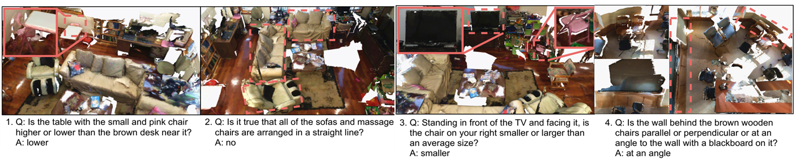

# 3D Question Answering



### [Paper (Latest)](https://shuquanye.com/3DQAlatest.pdf) | [Paper (ArXiv)](https://arxiv.org/abs/2112.08359) | [Project Page](https://shuquanye.com/3DQA_website/) | [Pre-trained Models]() | [Fully Human-annotated Dataset]()

**This is the official repository for our paper *3D Question Answering*. Training code is coming soon.**

[Shuquan Ye](https://shuquanye.com/)<sup>1</sup>,
[Dongdong Chen](https://www.dongdongchen.bid/)<sup>2</sup>,
[Songfang Han](http://hansf.me/)<sup>3</sup>,
[Jing Liao](https://liaojing.github.io/html/)<sup>1</sup> <br>
<sup>1</sup>City University of Hong Kong, <sup>2</sup>Microsoft Cloud AI,<sup>3</sup> University of California

## Download

#### ScanQA dataset

The fully human-annotated ScanQA dataset with 9160 questions for train/validation and 902 questions for test can be downloaded in [this link](https://portland-my.sharepoint.com/:u:/g/personal/shuquanye2-c_my_cityu_edu_hk/EY8dtda7VqJPhVs4sBvnnywBxn2qtWuADDVaVqvjHrQ8vw?e=ozl9Xf).

#### Checkpoints

- Pre-trained checkpoint on color-only questions

- [Fine-tuned checkpoint on ScanQA](https://portland-my.sharepoint.com/:u:/g/personal/shuquanye2-c_my_cityu_edu_hk/EfZBIfMOlMdOhipOwbCF6c8BvE_v1YA-1uqEQMnZbiWlIg?e=4TjS5O)

## BibTeX

```
@article{ye20213d,
  author    = {Ye, Shuquan and Chen, Dongdong and Han, Songfang and Liao, Jing},
  title     = {Learning with Noisy Labels for Robust Point Cloud Segmentation},
  journal={arXiv preprint arXiv:2112.08359},
  year      = {2021},
}
```
